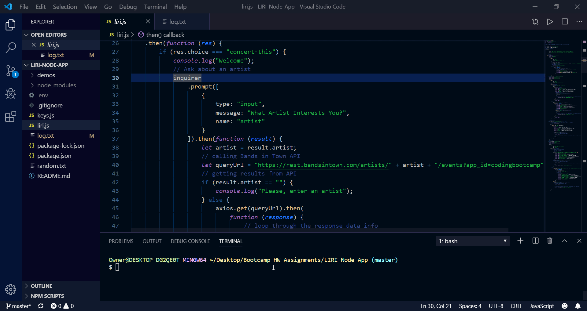
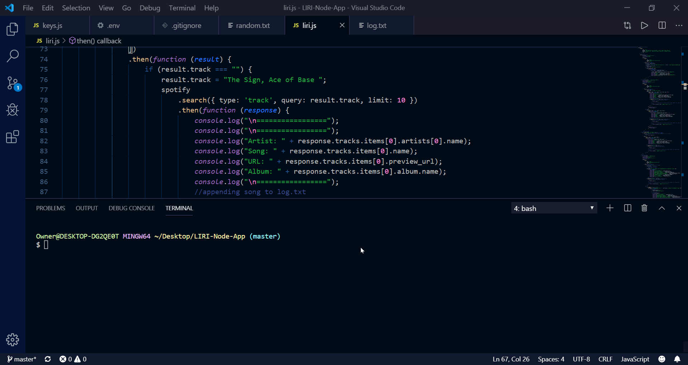
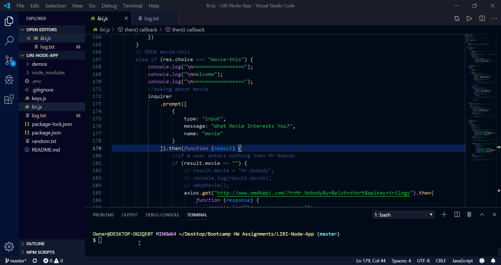

# LIRI-Bot

This program uses a command line interface to fetch information about media for the user. It interfaces with Spotify, BandsInTown, and the Open Movie Database in order to give users simple bits of information from one of these APIs.

To run the program, the user must execute ``` liri.js ``` in the command line whereupon they'll be given 4 prompts for them to choose:


  - concert-this
  - spotify-this-song
  - movie-this
  - do-what-it-says

# The APIs!

```Bands In Town```
This will show the following information about the song in your terminal/bash window:

Name of the venue
Venue location
Date of the Event (as "MM/DD/YYYY")

```Spotify``` This will show the following information about the song in your terminal/bash window:

Artist(s)
The song's name
A preview link of the song from Spotify
The album that the song is from If no song is provided then the program will default to "The Sign" by Ace of Base.

```OMBD movie database``` Shows the following information about the movie in the terminal:

Title of the movie.
Year the movie came out.
IMDB Rating of the movie.
Rotten Tomatoes Rating of the movie.
Country where the movie was produced.
Language of the movie.
Plot of the movie.
Actors in the movie. If the user doesn't type a movie in, the program will output data for the movie Mr. Nobody
All artists, movies and songs are stored in log.txt file

The choice ````do-what-it-says```` uses the fs Node package. LIRI will take the text inside of random.txt and then use it to call one of LIRI's commands.

It should run spotify-this-song for "I Want it That Way," as follows the text in random.txt

DEMO

*concert-this*



*spotify-this*


*movie-this*



*do-what-it-says*

